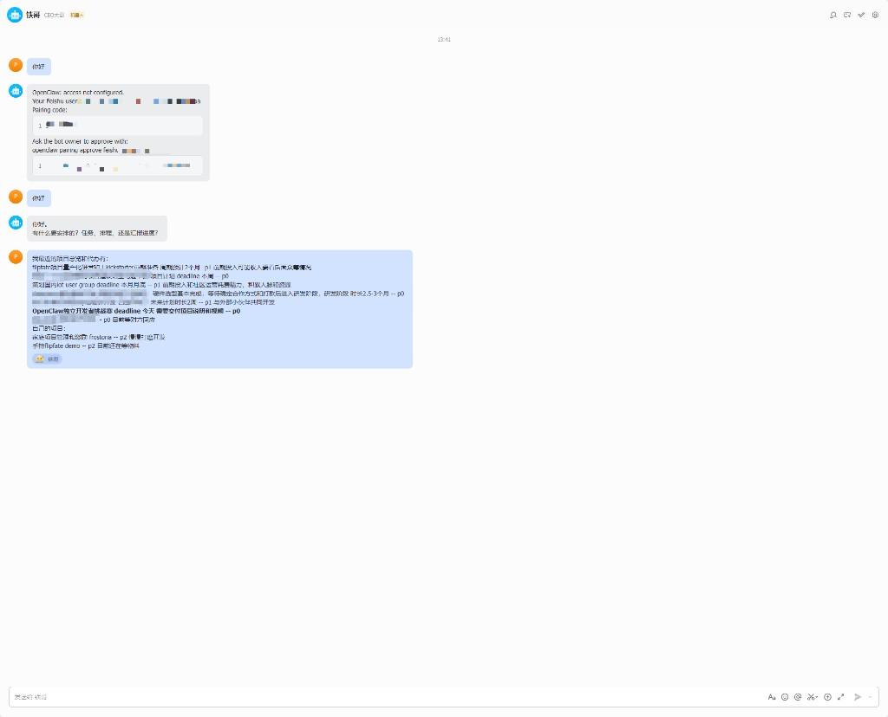
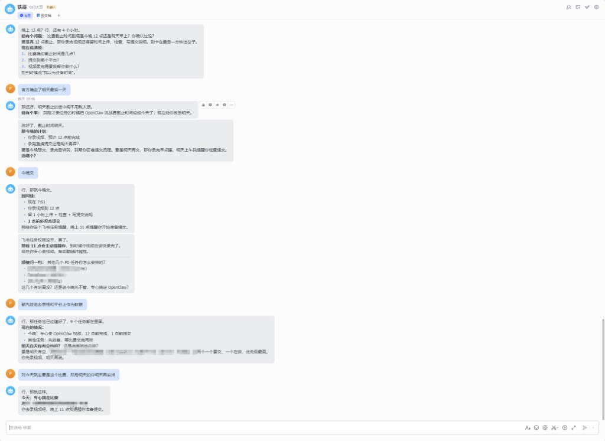
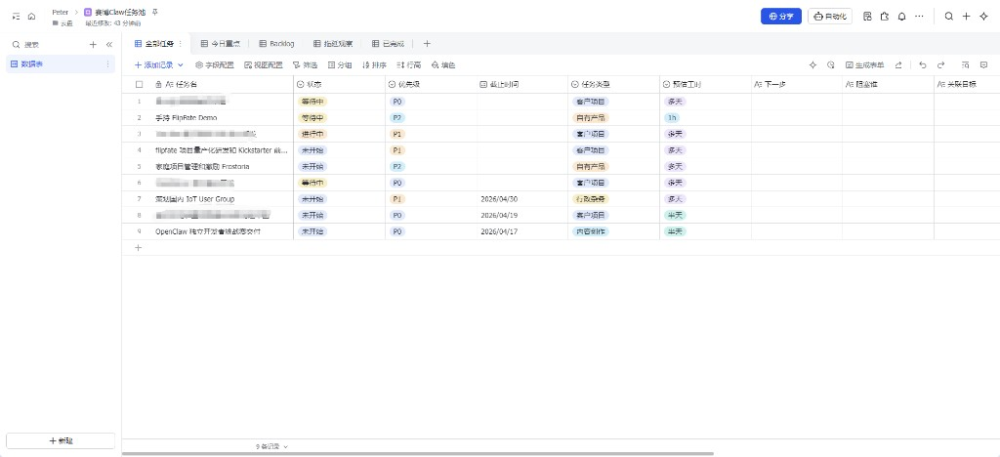
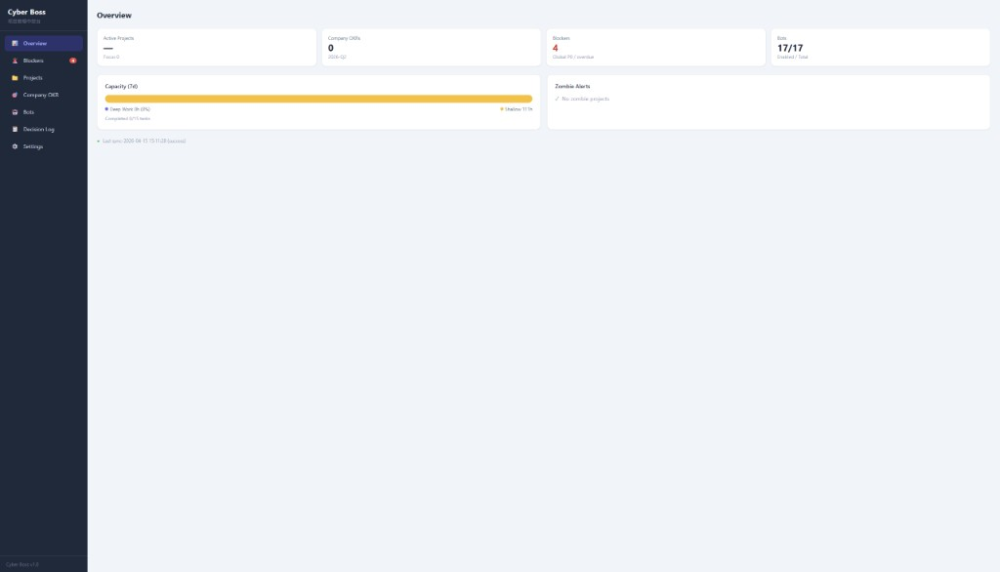
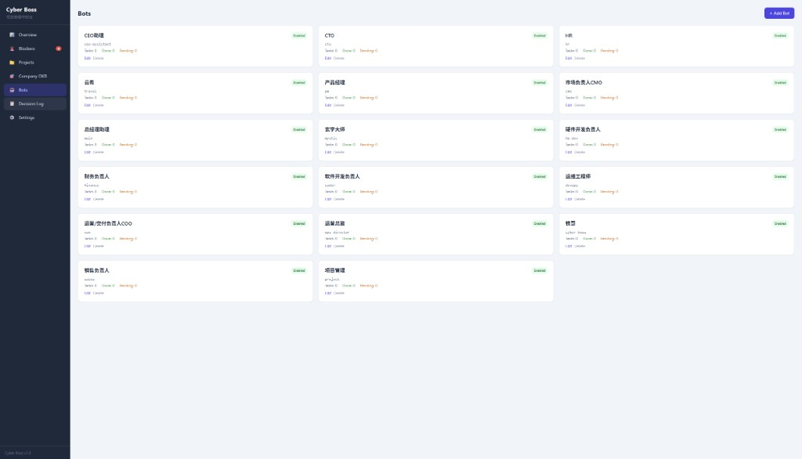
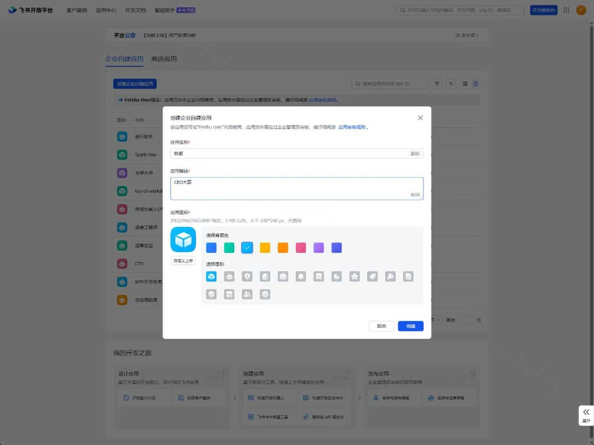
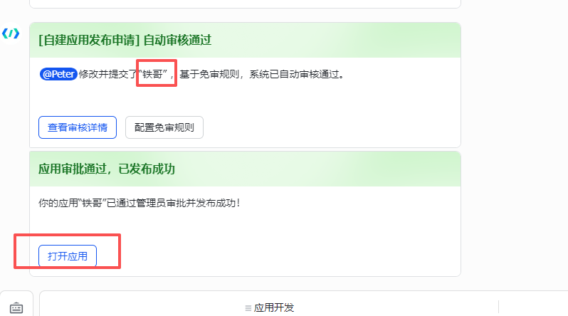
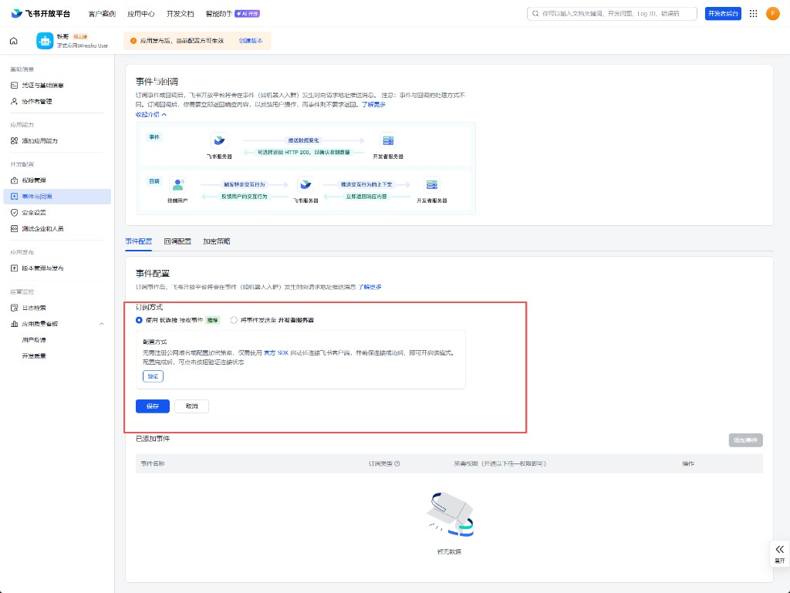

# Cyber Boss — AI 执行节奏管理系统

> 让 AI 从"被动工具人"变成"主动管理者"：一个会排优先级、会派任务、会催办、会复盘的赛博刻薄老板。

## 概述

Cyber Boss 是面向超级个体 / 一人公司的 AI 执行节奏管理系统，基于 [OpenClaw](https://github.com/nicepkg/openclaw) + 飞书生态构建。

核心理念是**角色反转**：人类是员工，AI 是老板。

Agent "铁哥" 每天从飞书多维表格（Bitable）读取你的真实任务池，按优先级排出今天该做的事，创建飞书任务，晚上检查你做了没有——对拖延行为绝不姑息。

## 截图

### 铁哥飞书对话 — 晨间排程


### 铁哥飞书对话 — 完整工作流（排程 → 派发 → 复盘）


### 飞书 Bitable 任务池（5 个视图 + 12 字段）


### Dashboard — Overview


### Dashboard — Bot 矩阵（17 个角色 Bot）


### 飞书开放平台 — 应用创建


### 飞书开放平台 — 应用审批发布


### 飞书开放平台 — 事件订阅（WebSocket 长连接）


## 架构

```
飞书用户 ←→ 飞书 WebSocket ←→ OpenClaw (Agent 引擎)
                                    │
                                    ├── TOOLS.md (人设 + 规则 + 工具)
                                    ├── Skills: feishu-bitable / feishu-task
                                    ├── Memory: workspace/cyber-boss/memory/
                                    │
                     ┌──────────────┴──────────────┐
                     ↓                              ↓
              飞书 Bitable                   Cyber Boss Dashboard
             (任务池唯一数据源)              (SQLite + Express + Vue 3)
                     │                              │
                     └──── sync/trigger ────────────┘
```

## 项目结构

```
cyber-boss/
├── dashboard/                  # 管理后台
│   ├── server.mjs              # Express + SQLite 后端
│   ├── public/index.html       # Vue 3 + Tailwind SPA
│   ├── package.json
│   └── Dockerfile
├── skill/                      # OpenClaw Agent 完整配置
│   ├── SKILL.md                # Skill 元描述
│   ├── TOOLS.md.example        # 工具 + Bitable 配置 + 触发机制
│   ├── IDENTITY.md.example     # 铁哥身份定义
│   ├── SOUL.md.example         # 铁哥灵魂 / 性格 / 说话风格
│   ├── USER.md.example         # 用户画像
│   ├── AGENTS.md.example       # 工作空间启动流程
│   ├── HEARTBEAT.md.example    # 定期巡检任务
│   └── _meta.json
├── trigger/                    # 主动触发脚本
│   └── cyber-boss-trigger.py
├── docs/                       # 文档 + 截图
├── docker-compose.yml          # Dashboard 部署
├── .env.example                # 环境变量模板
└── README.md
```

## 功能

### Agent（铁哥）
- **任务录入** — 聊天零切换写入 Bitable 任务池
- **晨间排程** — 读取任务池，基于 deadline / 优先级 / 阻塞关系 / OKR 对齐度，选出 1-3 件核心任务
- **飞书任务派发** — 自动创建飞书任务并设定截止时间
- **晚间复盘** — 检查完成状态，毒舌点评拖延行为，写入决策日志
- **紧急打断** — 中途插入 P0 时重新评估今日计划
- **委派** — @mention 其他角色 Agent 处理对应任务

### Dashboard
- 项目全景（状态、进度、里程碑、阻塞项）
- OKR 追踪（Company / Project 两级，Key Results 进度 + 信心指数）
- Bot 矩阵注册与任务统计
- Bitable 一键同步（`/api/sync/trigger`）
- 决策日志（自动读取 Agent memory 目录）

### 主动触发
- `cyber-boss-trigger.py` + cron 实现工作日早 9 晚 9 自动触发 Agent

## 快速开始

### 前置条件

- [OpenClaw](https://github.com/nicepkg/openclaw) 已部署
- 飞书开放平台已创建应用（需要 `bitable:app` 和 `im:message` 权限）
- 飞书多维表格已创建（参见下方 Bitable Schema）

### 1. 配置环境变量

```bash
cp .env.example .env
# 编辑 .env，填入你的飞书凭据和 Bitable ID
```

### 2. 部署 Dashboard

```bash
docker compose up -d
```

Dashboard 默认运行在 `http://localhost:18062`

### 3. 配置 OpenClaw Agent

将 `skill/TOOLS.md.example` 复制到 OpenClaw workspace：

```bash
cp skill/TOOLS.md.example /path/to/openclaw/data/workspace/cyber-boss/TOOLS.md
# 编辑 TOOLS.md，替换 <YOUR_BITABLE_BASE_ID> 和 <YOUR_BITABLE_TABLE_ID>
```

将 `skill/SKILL.md` 和 `skill/_meta.json` 复制到 OpenClaw skills 目录。

### 4. 配置主动触发（可选）

```bash
# 晨间排程 (工作日早 9 点)
0 9 * * 1-5 FEISHU_APP_ID=xxx FEISHU_APP_SECRET=xxx FEISHU_USER_OPEN_ID=xxx python3 /path/to/cyber-boss-trigger.py morning

# 晚间复盘 (工作日晚 9 点)
0 21 * * 1-5 FEISHU_APP_ID=xxx FEISHU_APP_SECRET=xxx FEISHU_USER_OPEN_ID=xxx python3 /path/to/cyber-boss-trigger.py evening
```

## Bitable 任务池 Schema

在飞书多维表格中创建数据表，字段定义：

| 字段名 | 类型 | 必填 | 说明 |
|--------|------|------|------|
| 任务名 | 文本 | ✅ | 一句话描述 |
| 状态 | 单选 | ✅ | 未开始 / 进行中 / 已完成 / 等待中 / 阻塞 / 已下架 |
| 优先级 | 单选 | ✅ | P0 / P1 / P2 / P3 |
| 截止时间 | 日期 | | 硬 deadline |
| 任务类型 | 单选 | | 客户项目 / 自有产品 / 内容创作 / 行政杂务 / 学习研究 / 运维 |
| 预估工时 | 单选 | | 15min / 30min / 1h / 2h / 半天 / 全天 / 多天 |
| 下一步 | 文本 | | 当前可执行的最小动作 |
| 阻塞谁 | 文本 | | 不做会卡住什么 |
| 关联目标 | 文本 | | 对应的 Goal 或 KR 编号 |
| 连续拖延天数 | 数字 | | Boss 自动维护，初始 0 |
| 来源 | 单选 | | 聊天录入 / 发票触发 / 日历事件 / 手动创建 |
| 备注 | 文本 | | 补充上下文 |

推荐视图：全部任务、今日重点、Backlog、拖延观察、已完成

## API

Dashboard 提供 REST API：

| 端点 | 说明 |
|------|------|
| `GET /api/overview` | 全局概览（项目统计、OKR、阻塞项） |
| `GET/POST /api/projects` | 项目 CRUD |
| `GET/POST /api/objectives` | Objective CRUD |
| `GET/POST /api/key-results` | Key Result CRUD |
| `POST /api/key-results/:id/update` | 更新 KR 进度 |
| `GET/POST /api/bots` | Bot 注册管理 |
| `POST /api/sync/trigger` | 从 Bitable 同步任务到 Dashboard |
| `GET /api/task-snapshots` | 查看任务快照 |
| `GET /api/decision-log` | 查看决策日志 |
| `GET/PUT /api/settings` | Dashboard 配置 |

## 已知限制

1. **OpenClaw 无原生主动触发** — 必须靠外部 cron 脚本伪装主动性
2. **跨会话状态依赖 memory/ 文件** — 有效但原始
3. **LLM 工具调用约 20% 概率跳过步骤** — 任务池大时更明显
4. **Agent 间委派无确认回调** — 委派后需手动检查结果

## License

MIT
